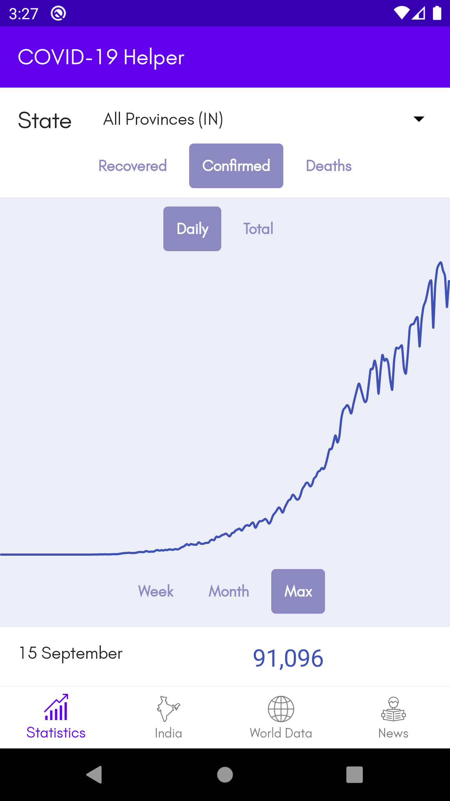
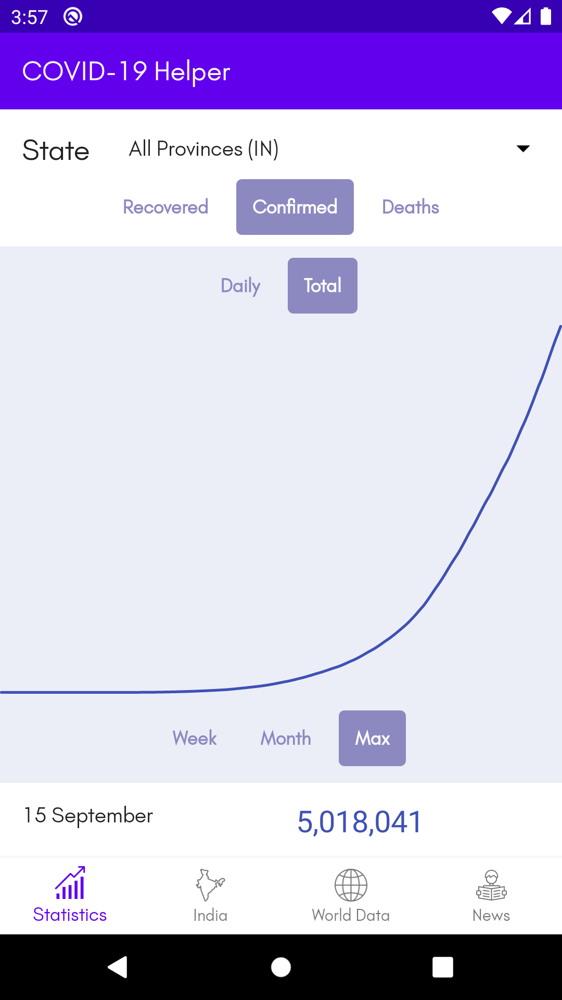
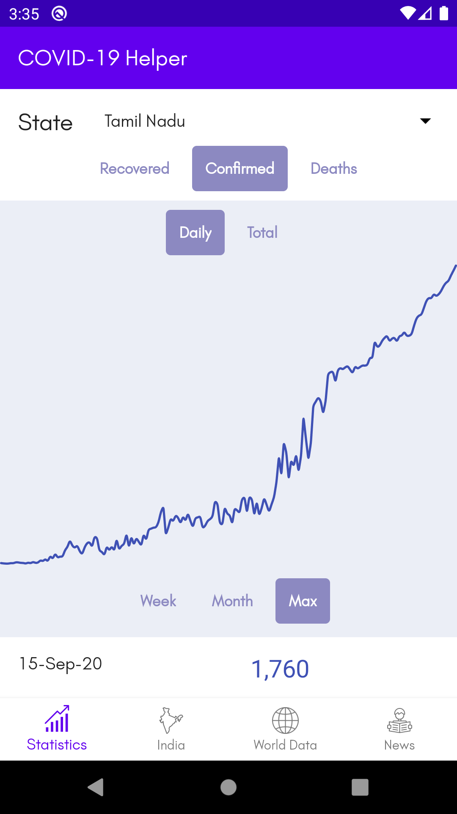
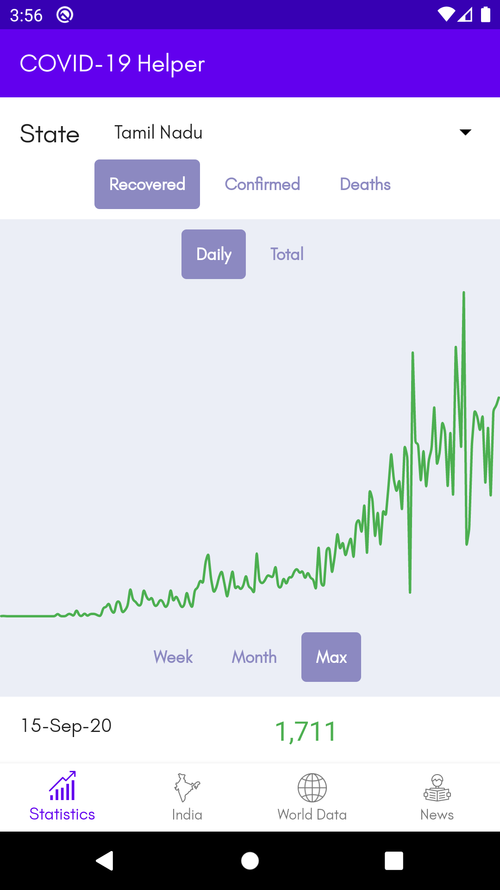
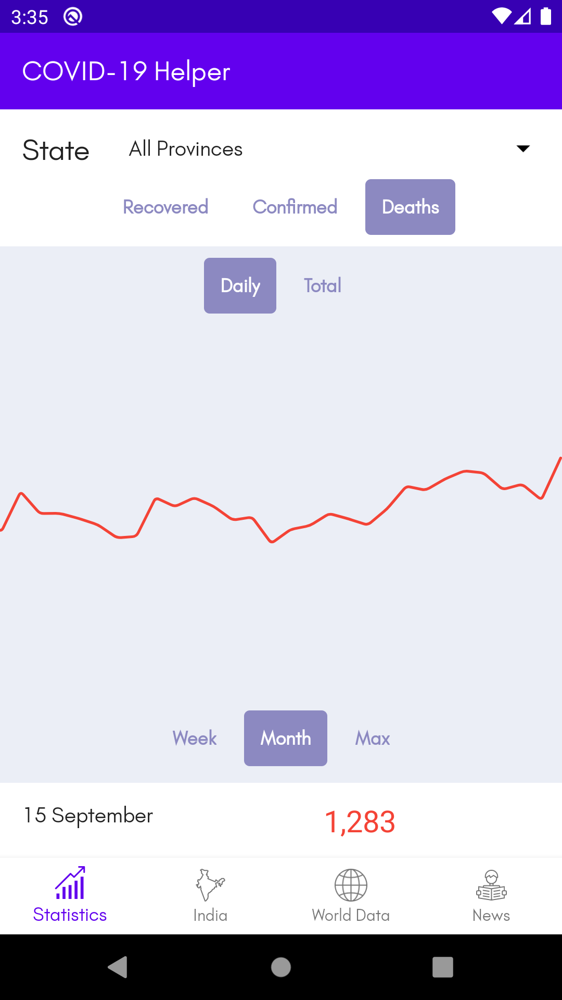
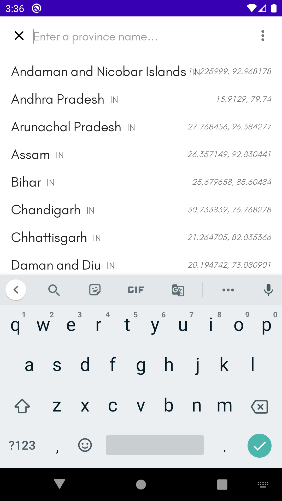
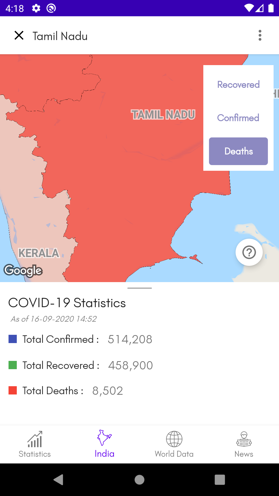
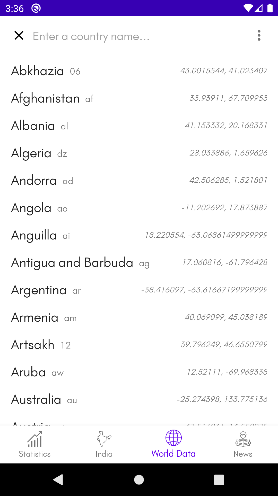
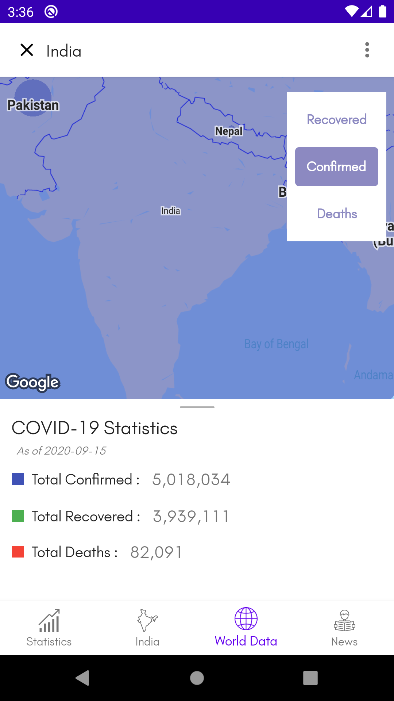

# COVID-19 Helper and Info App
 

 

This is an App which makes use of [COVID-19 India API](https://api.covid19india.org/) and a few other APIs mentioned here, to display the Daily Increase of Corona Virus Cases in India, Nationwide and State-wise. All Glory to God for helping me in this and to my parents for their support.

Firstly, A Big Shout out and thanks to all medical staff, police and everyone working in the frontlines of this pandemic, some of who also sacrified their lives. God bless their effort.

Originally it was taught by [Rahul Pandey](https://github.com/rpandey1234) Sir, (check out his youtube tutorial [here](https://www.youtube.com/playlist?list=PL7NYbSE8uaBB1EiPYScD66ZVWyu6cOyrR))

This app makes use of MVVM architecture and Kotlin Coroutines.
The clean architecture of the app was inspired by the [MVVM news App](https://www.youtube.com/playlist?list=PLQkwcJG4YTCRF8XiCRESq1IFFW8COlxYJ) 
by [Philipp Lackner](https://github.com/androiddevs18/MVVMNewsApp)

A Big Shout-out and thanks to both of them, God Bless them. Do subscribe to both their YouTube channels!

Thanks to [Yaswant Narayan](https://github.com/MINOSai) for his guidance. Also special thanks to [Ivan Jacob](https://www.linkedin.com/in/ivansaviojacob/) for helping me.

UI is inspired by the Robinhood Stock Trading App.

Libraries used:
- [Spark from Robinhood](https://github.com/robinhood/spark)
- [Ticker from Robinhood](https://github.com/robinhood/ticker)
- [Nice Spinner](https://github.com/arcadefire/nice-spinner)
- [Dagger Hilt](https://dagger.dev/hilt/) for Dependency Injections
- [Lottie Animations](https://github.com/airbnb/lottie-android)

### Screenshots: 
||||
|:--:|:--:|:--:|
|*Splash Screen*|*Main Fragment*|*Toggle between Daily and Total numbers*|

You could view statistics for other provinces in India using the spinner,
||||
|:--:|:--:|:--:|
|*Select a province*|*Tamil Nadu*|*Tamil Nadu Daily Recovered*|

Also change between overall and monthly timeline view:
|||
|:--:|:--:|
|*Daily death increase*|*Death increase over a month*|

In the Other Fragments,
made use of Google Maps API v2, [SDk for android](https://developers.google.com/maps/documentation/android-sdk/overview)
- India Fragment, used a Choropleth Plot to visualize the statistics
- World Fragment, used a Bubble Chart

For the Choropleth plot,
1. I've obtained the Boundaries from OpenMaps API, in a .geojson format
 

 

I've collected the boundary data from their [Nominatim Search Tool](https://nominatim.openstreetmap.org/ui/search.html) and then used the OSM Id and downloaded the .geojson polygon from this [download tool](http://polygons.openstreetmap.fr/). The files are very large, so to shrink them while preserving most of the structure, I used this [MapShaper](https://mapshaper.org/) an [OpenSource Tool](https://github.com/mbloch/mapshaper). These files are included in this repo.

2. To overlay the tiles, I've used Google Map's [Util SDK](https://github.com/googlemaps/android-maps-utils) which has support for overlaying .geojson files.
Some of the files had bad formatting, so to verify that I used this [tool](https://geojsonlint.com/)

3. The Indian States data I've Obtained from [this API](https://covid19.mathdro.id/api/countries/India/)

||||
|:--:|:--:|:--:|
|*Cholorpleth Map for Indian Provinces*|*Search for a province*|*Detail stats for Tamil Nadu*|

For the Bubble Chart,
I chose a scale for the radius of the circles though I need to improve upon it. As for the data, [this API](https://www.trackcorona.live/api) provides data with LatLng for a country.

Google Maps SDk for Android has a default class to overlay circles of a certain radius.

||||
|:--:|:--:|:--:|
|*World Data*|*Search for a country*|*Detail stats for India*|

And Finally, for the News Fragment.
I've made use of the [NewsAPI](https://newsapi.org/)'s free tier. It's a really good API to use for incorporating news in your app.

To view the article, I've made use of Google's [Chrome Custom Tab](https://developers.google.com/web/android/custom-tabs/implementation-guide).

|||
|:--:|:--:|
|*News related to COVID-19*|*Viewing of article's cource*|

Other Notable libraries which were helpful are:
- [Timber](https://github.com/JakeWharton/timber) for logging, really good!
- [JSON to Kotlin](https://plugins.jetbrains.com/plugin/9960-json-to-kotlin-class-jsontokotlinclass-), a plugin for Android Studio, really amazing!
- [Glide](https://github.com/bumptech/glide) for image loading, highly recommended!
