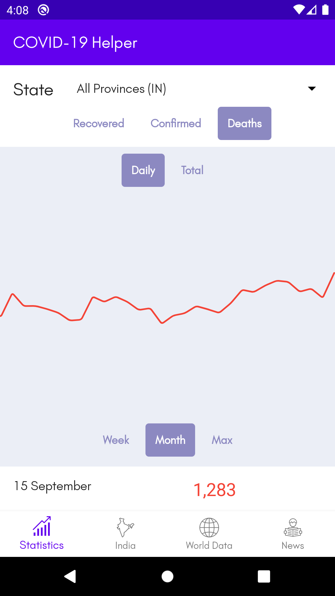

# COVID-19 Helper and Info App
 

 

This is an App which makes use of [COVID-19 India API](https://api.covid19india.org/) to display the Daily Increase of Corona Virus Cases in India,
Nationwide and State-wise. 

Firstly, A Big Shout out and thanks to all medical staff, police and everyone working in the frontlines of this pandemic, some of who also sacrified their lives. God bless their effort.

Originally it was taught by Rahul Pandey Sir, (check out his youtube tutorial [here](https://www.youtube.com/playlist?list=PL7NYbSE8uaBB1EiPYScD66ZVWyu6cOyrR))

This app makes use of MVVM architecture and Kotlin Coroutines.
The clean architecture of the app was inspired by the [MVVM news App](https://www.youtube.com/playlist?list=PLQkwcJG4YTCRF8XiCRESq1IFFW8COlxYJ) 
by [Philipp Lackner](https://github.com/androiddevs18/MVVMNewsApp)

A Big Shout-out and thanks to both of them, God Bless them. Do subscribe to both their YouTube channels!

UI is inspired by the Robinhood Stock Trading App.

Libraries used:
- [Spark from Robinhood](https://github.com/robinhood/spark)
- [Ticker from Robinhood](https://github.com/robinhood/ticker)
- [Nice Spinner](https://github.com/arcadefire/nice-spinner)
- [Dagger Hilt](https://dagger.dev/hilt/) for Dependency Injections
- [Lottie Animations](https://github.com/airbnb/lottie-android)

### Screenshots: 
||||
|:--:|:--:|:--:|
|*Splash Screen*|*Main Fragment*|*Toggle between Daily and Total numbers*|

You could view statistics for other provinces in India using the spinner,
||||
|:--:|:--:|:--:|
|*Select a province*|*Tamil Nadu*|*Tamil Nadu Daily Recovered*|

Also change between overall and monthly timeline view:
||||
|:--:|:--:|:--:|
|*Daily death increase*|*Death increase over a month*|*Tamil Nadu Daily Recovered*|
